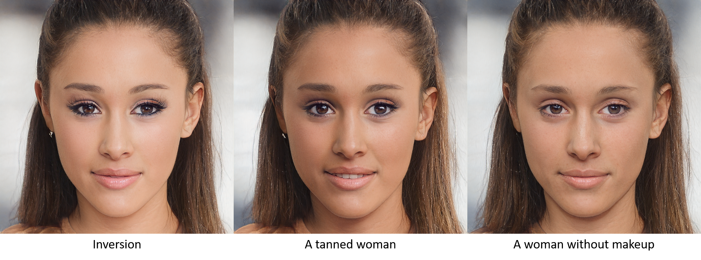
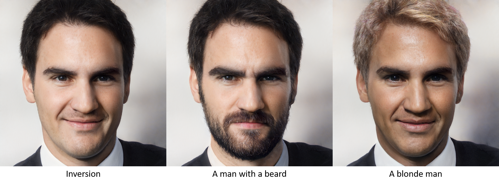
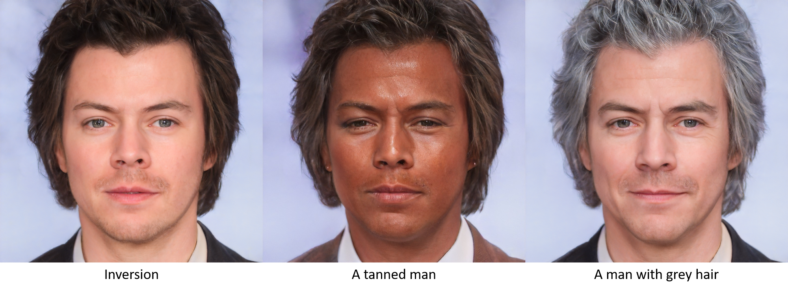
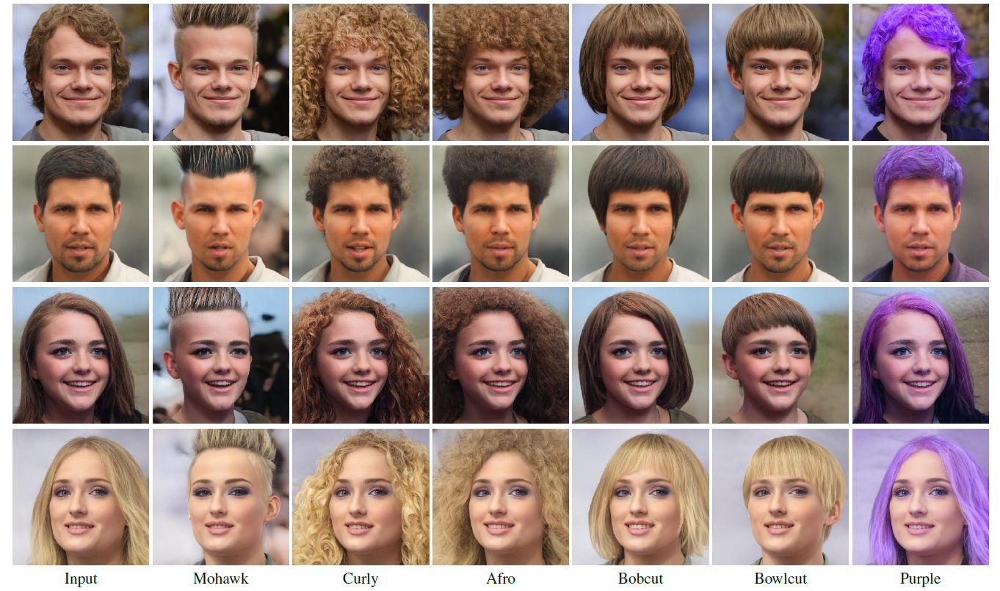
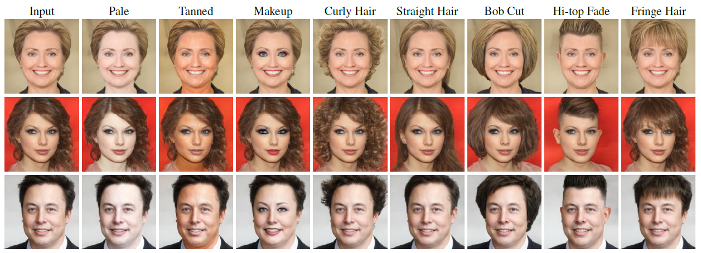
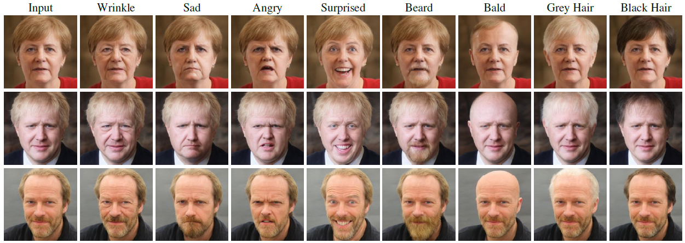
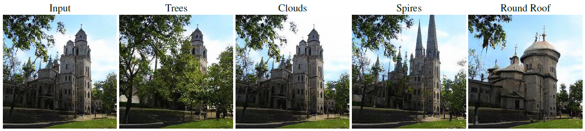

# StyleCLIP: Text-Driven Manipulation of StyleGAN Imagery

Optimization: [](http://colab.research.google.com/github/orpatashnik/StyleCLIP/blob/main/notebooks/optimization_playground.ipynb)
Global directions: [](https://colab.research.google.com/github/orpatashnik/StyleCLIP/blob/main/notebooks/StyleCLIP_global.ipynb)
Mapper: [](https://colab.research.google.com/github/orpatashnik/StyleCLIP/blob/main/notebooks/mapper_playground.ipynb)

<p align="center">
  <a href="https://www.youtube.com/watch?v=5icI0NgALnQ"></a>
  
  Check our full demo video here: <a href="https://www.youtube.com/watch?v=5icI0NgALnQ"></a>
  
</p>


> **StyleCLIP: Text-Driven Manipulation of StyleGAN Imagery**<br>
> Or Patashnik*, Zongze Wu*, Eli Shechtman, Daniel Cohen-Or, Dani Lischinski <br>
> *Equal contribution, ordered alphabetically <br>
> https://arxiv.org/abs/2103.17249 <br>
>
>**Abstract:** Inspired by the ability of StyleGAN to generate highly realistic
images in a variety of domains, much recent work has
focused on understanding how to use the latent spaces of
StyleGAN to manipulate generated and real images. However,
discovering semantically meaningful latent manipulations
typically involves painstaking human examination of
the many degrees of freedom, or an annotated collection
of images for each desired manipulation. In this work, we
explore leveraging the power of recently introduced Contrastive
Language-Image Pre-training (CLIP) models in order
to develop a text-based interface for StyleGAN image
manipulation that does not require such manual effort. We
first introduce an optimization scheme that utilizes a CLIP-based
loss to modify an input latent vector in response to a
user-provided text prompt. Next, we describe a latent mapper
that infers a text-guided latent manipulation step for
a given input image, allowing faster and more stable textbased
manipulation. Finally, we present a method for mapping
a text prompts to input-agnostic directions in StyleGAN’s
style space, enabling interactive text-driven image
manipulation. Extensive results and comparisons demonstrate
the effectiveness of our approaches.


## Description
Official Implementation of StyleCLIP, a method to manipulate images using a driving text. 
Our method uses the generative power of a pretrained StyleGAN generator, and the visual-language power of CLIP.
In the paper we present three methods: 
- Latent vector optimization.
- Latent mapper, trained to manipulate latent vectors according to a specific text description.
- Global directions in the StyleSpace.


## Updates
**6/4/2021** Add mapper training and inference (including a jupyter notebook) code

**6/4/2021** Add support for custom StyleGAN2 and StyleGAN2-ada models, and also custom images

**2/4/2021** Add the global directions code (a local GUI and a colab notebook)

**31/3/2021** Upload paper to arxiv, and video to YouTube

**14/2/2021** Initial version

## Setup  (for all three methods)
For all the methods described in the paper, is it required to have:
- Anaconda
- [CLIP](https://github.com/openai/CLIP)

Specific requirements for each method are described in its section. 
To install CLIP please run the following commands:
  ```shell script
conda install --yes -c pytorch pytorch=1.7.1 torchvision cudatoolkit=<CUDA_VERSION>
pip install ftfy regex tqdm gdown
pip install git+https://github.com/openai/CLIP.git
```


## Editing via Latent Vector Optimization

### Setup

Here, the code relies on the [Rosinality](https://github.com/rosinality/stylegan2-pytorch/) pytorch implementation of StyleGAN2.
Some parts of the StyleGAN implementation were modified, so that the whole implementation is native pytorch.

In addition to the requirements mentioned before, a pretrained StyleGAN2 generator will attempt to be downloaded, (or manually download from [here](https://drive.google.com/file/d/1EM87UquaoQmk17Q8d5kYIAHqu0dkYqdT/view?usp=sharing)).

### Usage

Given a textual description, one can both edit a given image, or generate a random image that best fits to the description.
Both operations can be done through the `main.py` script, or the `optimization_playground.ipynb` notebook ([](http://colab.research.google.com/github/orpatashnik/StyleCLIP/blob/main/notebooks/optimization_playground.ipynb)).

#### Editing
To edit an image set `--mode=edit`. Editing can be done on both provided latent vector, and on a random latent vector from StyleGAN's latent space.
It is recommended to adjust the `--l2_lambda` according to the desired edit. 

#### Generating Free-style Images
To generate a free-style image set `--mode=free_generation`.

## Editing via Latent Mapper
Here, we provide the code for the latent mapper. The mapper is trained to learn *residuals* from a given latent vector, according to the driving text.
The code for the mapper is in `mapper/`.

### Setup
As in the optimization, the code relies on [Rosinality](https://github.com/rosinality/stylegan2-pytorch/) pytorch implementation of StyleGAN2.
In addition the the StyleGAN weights, it is neccessary to have weights for the facial recognition network used in the ID loss. 
The weights can be downloaded from [here](https://drive.google.com/file/d/1KW7bjndL3QG3sxBbZxreGHigcCCpsDgn/view?usp=sharing).

The mapper is trained on latent vectors. It is recommended to train on *inverted real images*. 
To this end, we provide the CelebA-HQ that was inverted by e4e:
[train set](https://drive.google.com/file/d/1gof8kYc_gDLUT4wQlmUdAtPnQIlCO26q/view?usp=sharing), [test set](https://drive.google.com/file/d/1j7RIfmrCoisxx3t-r-KC02Qc8barBecr/view?usp=sharing).

### Usage

#### Training
- The main training script is placed in `mapper/scripts/train.py`.
- Training arguments can be found at `mapper/options/train_options.py`.
- Intermediate training results are saved to opts.exp_dir. This includes checkpoints, train outputs, and test outputs.
Additionally, if you have tensorboard installed, you can visualize tensorboard logs in opts.exp_dir/logs.
Note that
- To resume a training, please provide `--checkpoint_path`.
- `--description` is where you provide the driving text.
- If you perform an edit that is not supposed to change "colors" in the image, it is recommended to use the flag `--no_fine_mapper`.

Example for training a mapper for the moahwk hairstyle:
```bash
cd mapper
python train.py --exp_dir ../results/mohawk_hairstyle --no_fine_mapper --description "mohawk hairstyle"
```
All configurations for the examples shown in the paper are provided there.

#### Inference
- The main inferece script is placed in `mapper/scripts/inference.py`.
- Inference arguments can be found at `mapper/options/test_options.py`.
- Adding the flag `--couple_outputs` will save image containing the input and output images side-by-side.

Pretrained models for variuos edits are provided. Please refer to `utils.py` for the complete links list.

We also provide a notebook for performing inference with the mapper Mapper notebook: [](https://colab.research.google.com/github/orpatashnik/StyleCLIP/blob/main/notebooks/mapper_playground.ipynb)

## Editing via Global Direction

Here we provide GUI for editing images with the global directions. 
We provide both a jupyter notebook [](https://colab.research.google.com/github/orpatashnik/StyleCLIP/blob/main/notebooks/StyleCLIP_global.ipynb),
and the GUI used in the [video](https://www.youtube.com/watch?v=5icI0NgALnQ).
For both, the linear direction are computed in **real time**.
The code is located at `global_directions/`.

  
### Setup
Here, we rely on the [official](https://github.com/NVlabs/stylegan2) TensorFlow implementation of StyleGAN2.

It is required to have TensorFlow, version 1.14 or 1.15 (`conda install -c anaconda tensorflow-gpu==1.14`).

### Usage


#### Local GUI

To start the local GUI please run the following commands:

```shell script
cd global_directions

# input dataset name 
dataset_name='ffhq' 

# pretrained StyleGAN2 model from standard [NVlabs implementation](https://github.com/NVlabs/stylegan2) will be download automatically.
# pretrained StyleGAN2-ada model could be download from https://nvlabs-fi-cdn.nvidia.com/stylegan2-ada/pretrained/ .
# for custom StyleGAN2 or StyleGAN2-ada model, please place the model under ./StyleCLIP/global_directions/model/ folder.


# input prepare data 
python GetCode.py --dataset_name $dataset_name --code_type 'w'
python GetCode.py --dataset_name $dataset_name --code_type 's'
python GetCode.py --dataset_name $dataset_name --code_type 's_mean_std'

# preprocess (this may take a few hours). 
# we precompute the results for StyleGAN2 on ffhq, StyleGAN2-ada on afhqdog, afhqcat. For these model, we can skip the preprocess step.
python SingleChannel.py --dataset_name $dataset_name

# generated image to be manipulated 
# this operation will generate and replace the w_plu.npy and .jpg images in './data/dataset_name/' folder. 
# if you you want to keep the original data, please rename the original folder.
# to use custom images, please use e4e encoder to generate latents.pt, and place it in './data/dataset_name/' folder, and add --real flag while running this function.
# you may skip this step if you want to manipulate the real human faces we prepare in ./data/ffhq/ folder.   
python GetGUIData.py --dataset_name $dataset_name

# interactively manipulation 
python PlayInteractively.py --dataset_name $dataset_name
```

As shown in the video, to edit an image it is requires to write a _neutral text_ and a _target text_. 
To operate the GUI, please do the following:
- Maximize the window size
- Double click on the left square to choose an image. The images are taken from  `global_directions/data/ffhq`, and the corresponding latent vectors are in `global_directions/data/ffhq/w_plus.npy`.
- Type a neutral text, then press enter
- Modify the target text so that it will contain the target edit, then press enter.

You can now play with:
- *Manipulation strength* - positive values correspond to moving along the target direction.
- *Disentanglement threshold* - large value means more disentangled edit, just a few channels will be manipulated so only the target attribute will change (for example, grey hair). Small value means less disentangled edit, a large number of channels will be manipulated, related attributes will also change (such as wrinkle, skin color, glasses).

##### Examples:

| Edit  | Neutral Text | Target Text |
| --- | --- | --- |
| Smile  | face  | smiling face |
| Gender  | female face  | male face |
| Blonde hair | face with hair | face with blonde hair |
| Hi-top fade | face with hair | face with Hi-top fade hair |
| Blue eyes | face with eyes | face with blue eyes |

More examples could be found in the [video](https://www.youtube.com/watch?v=5icI0NgALnQ) and in the paper.


##### Pratice Tips: 
In the terminal, for every manipulation, the number of channels being manipulated is printed (the number is controlled by the attribute (neutral, target) and the disentanglement threshold).

1. For color transformation, usually 10-20 channels is enough. For large structure change (for example, Hi-top fade), usually 100-200 channels are required.
2. For an attribute (neutral, target), if you give a low disentanglement threshold, there are just few channels (<20) being manipulated, and usually it is not enough for performing the desired edit.


#### Notebook
Open the notebook in colab and run all the cells. In the last cell you can play with the image.

`beta` corresponds to the *disentanglement threshold*, and `alpha` to the *manipulation strength*. 

After you set the desired set of parameters, please run again the last cell to generate the image.

## Editing Examples

In the following, we show some results obtained with our methods. 
All images are real, and were inverted into the StyleGAN's latent space using [e4e](https://github.com/omertov/encoder4editing). 
The driving text that was used for each edit appears below or above each image.

#### Latent Optimization






#### Latent Mapper



#### Global Directions






## Related Works

The global directions we find for editing are direction in the _S Space_, which was introduced and analyzed in [StyleSpace](https://arxiv.org/abs/2011.12799) (Wu et al).

To edit real images, we inverted them to the StyleGAN's latent space using [e4e](https://arxiv.org/abs/2102.02766) (Tov et al.).

The code strcuture of the mapper is heavily based on [pSp](https://github.com/eladrich/pixel2style2pixel). 

## Citation

If you use this code for your research, please cite our paper:

```
@misc{patashnik2021styleclip,
      title={StyleCLIP: Text-Driven Manipulation of StyleGAN Imagery}, 
      author={Or Patashnik and Zongze Wu and Eli Shechtman and Daniel Cohen-Or and Dani Lischinski},
      year={2021},
      eprint={2103.17249},
      archivePrefix={arXiv},
      primaryClass={cs.CV}
}
```
